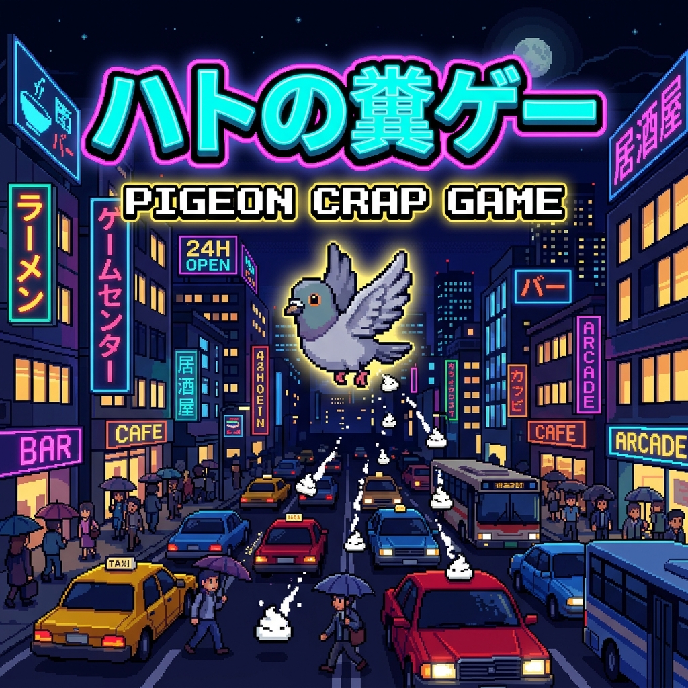

# ハトの糞ゲー 🕊️

鳩（ハト）を操作して、都会を飛び回りながらエサを食べ、迫り来る障害物を避け、歩行者や車に向けてフン爆弾を投下する横スクロール爽快アクションゲームです！

「クソゲー」のテーマにふさわしく、ユーモラスで爽快なプレイ感を提供します。

[](https://youtu.be/e4Hs6hFa9d8)

---

## 🎮 ゲームの特徴

1. **爽快な飛行物理と着地（Perching）システム**：
   - 羽ばたき時の浮遊感や慣性を物理シミュレーション。
   - 電線や電柱の先端に **Wキー / 上矢印キー** で着地可能！着地中はスタミナとフンの弾数が高速で回復します。
2. **フン爆撃（💩）**：
   - 下を歩く歩行者（サラリーマン、学生など）や走る車にフンを命中させると、面白い悲鳴リアクションと共に高得点を獲得！
3. **迫り来る障害物（敵）**：
   - 飛行高度を阻む「カラス」や、地上から突然飛び跳ねて襲ってくる「野良猫」を巧みに回避しましょう。
4. **ハト・ショップ（育成＆カスタム）**：
   - 集めたエサ（🍞）を使い、スタミナ上限、フン所持数、移動速度をアップグレード。
   - 特徴的なスキン（ノーマル、ゴールデン、サイバー、シャドウ）をアンロックしてステータス補正やパーティクル効果を楽しめます。
5. **完全内蔵シンセサイザー**：
   - Web Audio APIによる動的なサウンド生成を採用しているため、外部の音声ファイルなしで羽ばたき音、鳴き声（クルックー♪）、ヒット音、ゲームオーバー時のBGMが鳴ります。

---

## 🕹️ 操作方法

* **スペースキー または タップ**：羽ばたいてダッシュ
* **← / → / ↑ / ↓ キー (A / D / W / S)**：上下左右に飛行移動
* **Z / X / Shift キー または フンボタン**：フンを落とす 💩
* **電線や電柱の先端で ↑ (W) キー**：着地して休む
* **HUD右上のスピーカーアイコン**：音量のON / OFF切り替え

---

## 🚀 ローカルでの動かし方

このゲームにはハイスコアランキング機能が搭載されており、サーバーを利用したグローバルランキングの保存が可能です。

### Node.js サーバーで動かす場合 (推奨・ランキング機能対応)
プロジェクトのルートディレクトリで以下のコマンドを実行します。これにより、ゲームの配信とスコアランキングAPIが同時に立ち上がります。
```bash
node server.js
```
サーバー起動後、ブラウザで `http://localhost:3000` を開きます。スコアは `ranking.json` に自動保存されます。

### その他の簡易サーバーを使用する場合 (ローカルストレージへの保存にフォールバック)
通常のWebサーバー（Pythonのhttp.serverやnpx http-serverなど）でも動作します。この場合、スコアはブラウザのLocalStorageに保存されます。

* **Pythonを使用する場合**:
  ```bash
  python3 -m http.server 8000
  ```
  実行後、ブラウザで `http://localhost:8000` を開きます。

* **npx http-serverを使用する場合**:
  ```bash
  npx http-server
  ```

---

## 🌐 オンラインランキング (Supabase) の設定

このゲームは、**Supabase** を使用して世界中のプレイヤーとスコアを競えるグローバルランキング機能に対応しています。デフォルトで動作する設定になっていますが、独自のリポジトリやDBに切り替える場合は以下の手順で行います。

### 1. クライアント側の接続設定
[game.js](file:///Users/junichiakahori/Documents/Antigravity/hato-kusoge/game.js) 内の以下の定数をご自身のSupabaseプロジェクトのものに書き換えます。

```javascript
const SUPABASE_URL = 'https://your-project.supabase.co';
const SUPABASE_KEY = 'your-anon-public-key';
```

### 2. Supabase データベースのテーブル構成
Supabase上で、以下の構成で `ranking` テーブルを作成してください。

* **テーブル名**: `ranking`
* **RLS (Row Level Security)**: 必要に応じて `select` (読み取り) および `insert` (書き込み) のポリシーを許可してください。
* **カラム定義**:
  | カラム名 | データ型 | 説明 |
  | :--- | :--- | :--- |
  | `id` | int8 (Identity / Primary Key) | 自動インクリメントID |
  | `name` | text | プレイヤー名 (最大8文字) |
  | `score` | int8 | スコア |
  | `comment` | text | 一言コメント (最大20文字) |
  | `created_at` | timestamptz | 登録日時 (デフォルト値: `now()`) |

---

## 📂 ファイル構成
* `index.html` - UI、HUD、ショップメニュー、モバイルコントローラーの構造
* `style.css` - レトロアーケード風のネオン・ダークテーマスタイル
* `game.js` - メインのゲームループ、物理演算、描画、シンセサイザー、セーブデータ管理
* `server.js` - ローカル実行用のスコア保存API搭載Node.jsサーバー
